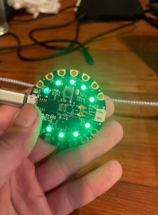
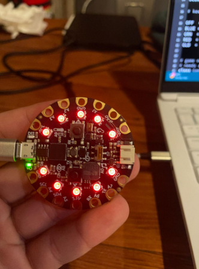
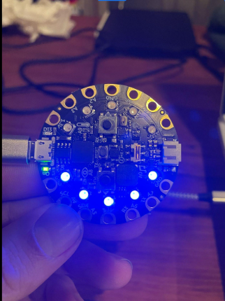

# Python Jack

A blackjack-style card game developed for the Adafruit Circuit Playground Express microcontroller.

## Description
Get as close to 5 as possible without going over. Play against a secret target number and earn chips to win the game.

## Features
- Object-oriented game logic with state management
- LED feedback system (blue = hand, green = score, red = loss, gold = win)
- Button-driven hit/stand controls with debouncing
- Dynamic audio-visual feedback with tone generation and LED animations

## Project Photos

### Win State (Green LEDs)

### Bust State (Red LEDs)

### Hand Display (Blue LEDs)

## Hardware
- Adafruit Circuit Playground Express
- Built-in LEDs and speakers
- A and B buttons for player input

## How to Run
1. Load the code onto your Circuit Playground Express using Mu Editor
2. Press button A to hit, button B to stand
3. Reach 5 chips to win!

## Technologies
- CircuitPython
- Adafruit libraries

## Authors
Kyle Faris & Nick Tugangui
